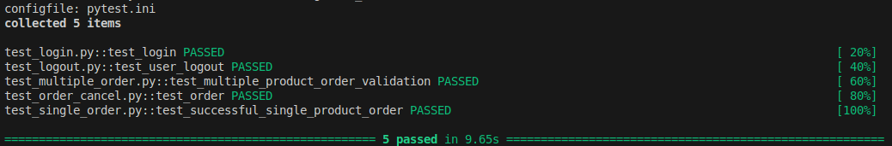

# SauceDemo Automation Project

This repository contains a comprehensive **Web Automation Test Suite** for the [Sauce Demo](https://www.saucedemo.com/) e-commerce website. The project follows the **Page Object Model (POM)** design pattern to ensure code reusability, maintainability, and clarity.

## 📊 Execution Result

*Above: Screenshot showing the successful execution of the test suite.*

## 🚀 Project Overview
The goal of this project was to automate the core user journey of an e-commerce platform, covering everything from secure authentication to the final order placement and session termination.

### Features Automated:
* **User Authentication:** Successful and failed login scenarios.
* **Product Management:** Adding single and multiple items to the shopping cart.
* **Checkout Flow:** Completing the purchase process with price and item count validations.
* **Order Cancellation:** Verifying that users can safely cancel an order during checkout.
* **Session Management:** Navigating the sidebar menu to successfully log out.

## 🛠️ Tech Stack
* **Language:** Python 3.x
* **Framework:** Pytest
* **Tool:** Selenium WebDriver
* **Driver Management:** WebDriver Manager (Auto-manages ChromeDriver)
* **Design Pattern:** Page Object Model (POM)

## 🧪 Key Testing Concepts Applied
* **Page Object Model:** Separated page-specific locators and behaviors from the test logic to enhance code reusability and maintenance.
* **Pytest Fixtures:** Managed the browser lifecycle (Setup/Teardown) globally within ``conftest.py`` to ensure each test starts with a fresh session.
* **Explicit/Implicit Waits:** Implemented synchronization strategies to handle dynamic element loading, significantly reducing test flakiness.
* **Custom Markers:** Utilized ``@pytest.mark`` to categorize tests, allowing for targeted execution of smoke or regression suites.
* **Chrome Options:** Configured the WebDriver to suppress browser-level pop-ups, such as password savers and automation infobars, for uninterrupted execution.